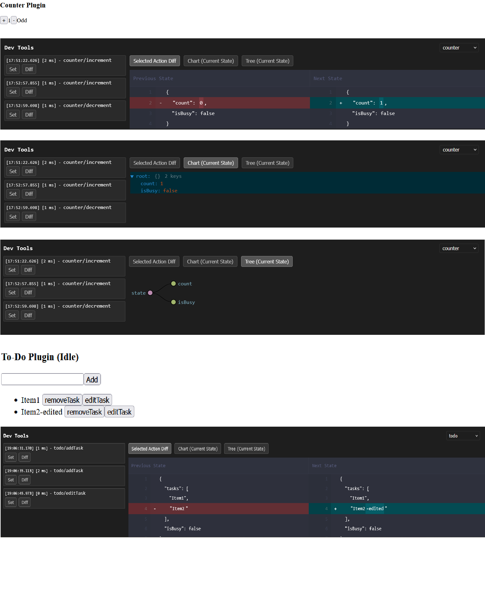

# ⚡ re-ignite: A blazing-fast, type-safe, and modular state management library


[](https://re-ignite.web.app)

**re-ignite** is a high-performance, fully typed, and extensible state management library built for modern web applications. It supports multiple stores, dynamic selectors, per-field subscriptions, built-in validation and logging, and a custom DevTools UI.

## 🚀 Why re-ignite?

-   ✅ Multiple stores like Zustand, but cleaner and strongly typed.
-   ✅ Actions and Selectors like Redux—without reducers/disptach or boilerplate.
-   ✅ Hook-free middleware system with clear separation (before/after).
-   ✅ Inbuilt Immer support for immutability.
-   ✅ Auto-generated property-based hooks using JavaScript Proxy.
-   ✅ React-compatible but works without React too.
-   ✅ DevTools with visual diffs, action replay, and time-travel basics.

## 🌟 Features Overview

### Core Features

-   ✅ Immutable state updates via **Immer**.
-   ✅ Fully type-safe: Actions, selectors, and state are strongly typed.
-   ✅ Multiple store support.
-   ✅ Sync middlewares with per-store/global config.
-   ✅ Built-in : Logging & Validation.
-   ✅ Built-in middlewares: Persistence.
-   ✅ Lightweight and testable (no React dependency).
-   ✅ Dynamic state access (via selectors or proxies).
-   ✅ State transformers: Transform state before applying.

### React-Specific Features

-   🎯 Auto-generated hooks: `store.hooks.useCount()`, `store.hooks.useProfile()`, `store.hooks.profile.useName()`. Nested object props too have prop level hooks.
-   🚫 Prevents unnecessary re-renders by default.

### DevTools

-   🎛️ Visual tree and chart view of the store state.
-   📜 Action log with diff view.
-   🔄 Re-dispatch last actions (primitive time travel).

## 🧑‍💻 Usage

```bash
yarn add re-ignite
# or
npm install re-ignite
```

Modules are bundled seperately. Can be used with below names

1. `re-ignite`	Core store creation logic, global config, utilities, and shared types.
2. `re-ignite/devTools`	DevTools integration (bridge, setup, etc). Intended for use with the state-devtools-app.
3. `re-ignite/middlewares`	Built-in middlewares like logger, validator, and error handler.
4. `re-ignite/persist`	State persistence via IndexedDB, including schema-safe APIs.
5. `re-ignite/transformers`	State transformers (like Immer integration) that mutate or adapt state updates.
6. `re-ignite/react`	React-specific bindings and hooks for store consumption in UI.

Note: Ensure your tsconfig.json has below things.

```json
  "module": "es2020",
  "moduleResolution": "bundler",
```


## 🏗️ Example Store

```ts
interface ICounterState {
    count: number;
    foo: string;
}

interface ICounterActions extends IAction {
    increment: () => void;
    decrement: () => void;
}

interface ICounterSelectors extends ISelector {
    isEven: () => boolean;
    getCount: () => number;
}

const counterStore = createStore<
    ICounterState,
    ICounterActions,
    ICounterSelectors
>({
    storeName: 'counter',
    initialState: { count: 0, foo: '' },
    actions: {
        increment: (state) => {
            state.count++;
        },
        decrement: (state) => {
            state.count--;
        },
    },
    selectors: {
        isEven: (state) => state.count % 2 === 0,
        getCount: (state) => state.count,
    },
    validations: {
        increment: (_prev, next) => {
            if (next.count > 100) throwValidationError('Max 100 reached.');
        },
        _: (_prev, next) => {
            if (next.count < 0)
                throwValidationError('Negative count not allowed.');
        },
    },
    storeConfig: {
        beforeMiddlewares: [validationMiddleware],
        afterMiddlewares: [loggerMiddleware],
        rollbackOnError: true,
        logDiff: true,
        useImmer: { produce },
        transformers: [immerTransformer],
    },
});
```

## 🪝 Dynamic Hooks

```ts
// given state:
{
  count: 0,
  profile: { age: 0, name: '' }
}

// in React
const age = store.hooks.profile.useAge(); // only subscribes to profile.age
const profile = store.hooks.useProfile(); // only subscribes to profile object
const count = store.hooks.useCount(); // only subscribes to count
```

## 🧩 Transformers

A transformer controls the next state before it get's applied. For: you don't want the % prop to go beyond 100.

```ts
useWithImmer(produce); // this configures the store to use immer and it's transfromer. produce function needs to be supplied from immer if you want to use immer.

// ex: immer transformer in built but needs to be configured like above.
export const immerTransformer: StateTransformer<any> = {
    name: 'immerTransformer',
    fn: (storeName, actionName, prevState, nextState, config, updater) => {
        if (!config.useImmer.produce)
            throw new Error('Missing Immer produce fn');
        return config.useImmer.produce(nextState, (draft) => updater(draft));
    },
};
```

## 🧱 Middlewares (Synchronous Only)

```ts
useWithLogger(); // this configures the store to use logger and it's middleware
useWithValidation(); // this configures the store to use validation and it's middleware

// ex: logger middleware
export const loggerMiddleware: Middleware<any> = {
    name: 'logger',
    type: 'after', // before | after | both
    fn: (storeName, actionName, _prev, _next, config, diff) => {
        if (config.logDiff) logDiff(storeName, actionName, config, diff);
    },
};
```

## 💾 Persistence (IndexedDB is experimental)

```ts
const themeStore = createStore({
    storeName: 'theme',
    initialState: { darkMode: false },
    persist: true,
    actions: {
        toggleTheme: (state) => {
            state.darkMode = !state.darkMode;
        },
    },
});
```

## 🧪 DevTools Integration

```ts
import { initDevToolsBridge } from 're-ignite/dist/devtools';
initDevToolsBridge(); // call inside __DEV__ only to avoid bundling dev tools to non dev environments.
```

```ts
// Console hacks.
window.__RE_IGNITE__.stores.counter.getState();
window.__RE_IGNITE__.stores.counter.setState({ count: 10 });
```

## 📸 Screenshot



## ⚖️ License

MIT

---

If re-ignite helps you build better apps, consider ⭐ starring the repo or sharing it! Open for contributions ❤️

## ChatGPT comparision

| Feature                       | 🔥 ReIgnite                                | 🧱 Redux                           | 🐻 Zustand          | ⚛️ Jotai               |
| ----------------------------- | ------------------------------------------ | ---------------------------------- | ------------------- | ---------------------- |
| **Boilerplate-free**          | ✅ Yes                                     | ❌ Lots (actions, reducers, types) | ✅ Mostly           | ✅                     |
| **Per-plugin modular stores** | ✅ Yes                                     | 🚫 Mostly global                   | ⚠️ Optional         | ⚠️ Possible with atoms |
| **Typed by default**          | ✅ Fully typed (state, actions, selectors) | ✅ (with effort)                   | ⚠️ Partial          | ✅                     |
| **Immer support**             | ✅ Enforced                                | Optional                           | Optional            | ❌                     |
| **Middleware**                | ✅ .NET/Node-style  powerful                     | ✅                                 | ❌                  | ⚠️ Limited             |
| **Validation logic**          | ✅ Built-in before state update            | 🚫 Manual                          | 🚫                  | 🚫                     |
| **Custom persistence**        | ✅ Typed IndexedDB (Dexie-style)           | ❌                                 | ✅ (localStorage)   | ⚠️ Atom-level          |
| **DevTools bridge**           | ✅ External App (plugin-friendly)          | ✅ via Redux DevTools              | ✅ (basic)          | ❌                     |
| **Testability**               | ✅ First-class                             | ⚠️ Needs setup                     | ⚠️ Possible         | ✅                     |
| **React binding**             | ✅ Optional + thin                         | ✅                                 | ✅                  | ✅                     |
| **Immutability enforced**     | ⚠️ Optional but simple                              | Optional                           | Optional            | ❌                     |
| **Global config**             | ✅ (`setGlobalConfig`)                     | 🚫                                 | 🚫                  | ❌                     |
| **Selectors**                 | ✅ Built-in                                | ✅                                 | ❌ (usually inline) | ❌                     |
| **Plugin-based architecture** | ✅ Native design                           | ❌                                 | ⚠️ Hackable         | ⚠️ Hackable            |
